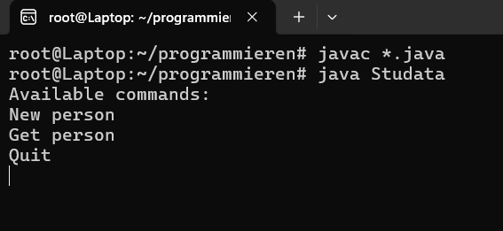

# Studata

This program gets user data to store from students. It is possible to delete and edit it later.

***
## Installation

Use console to compile and start program. Java needs to be installed on your system.
#### Install java

```bash
sudo apt update
sudo apt install openjdk-19-jdk
```

#### Compile and start
```bash
  javac *.java
  java Studata
```

If you did everything right you will see a menu:

  
Figure 1: Menu with controls
***
## Usage

#### Available Commands
- **New person:** Set data for new student.
- **Get person:** Get data of existing student.
- **Quit:** Shuts down the program.

## Exercises
- [Exercise1](exercise1.md)
- [Exercise2](exercise2.md)
- [Exercise3](exercise3.md)
- [Exercise4](exercise3.md)
- [Exercise5](exercise3.md)


## Contributing


- For any other requests or issues please message: [Contact Us](mailto:j.sieff@studata.io)


- If you want to contribute: [PaypalMe](https://www.paypal.com)

## Author

©2024 Jonas Sieff 

My Github: https://github.com/Headline42/msd23_Sieff_Jonas

My University: https://www.fh-joanneum.at/