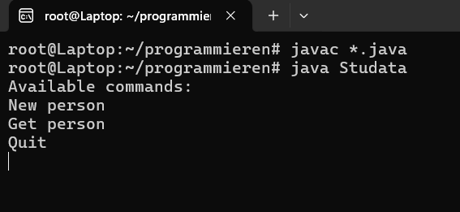

# Exercise1

## This is the first headline!

_Figure 1:_ This is the same picture as in README. For further information check: [README](README.md)

### This is the second headline!

You are now reading my first paragraph written in Markdown